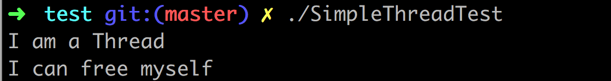
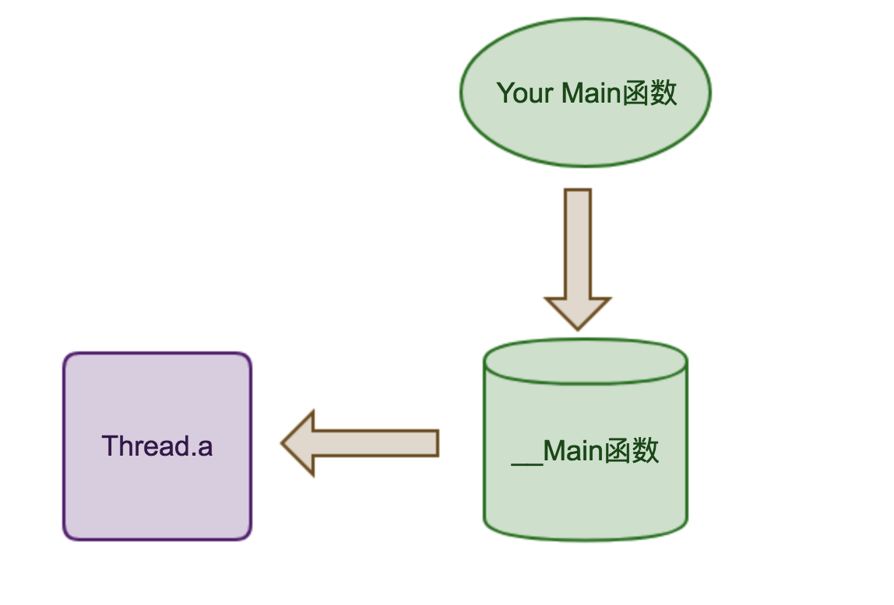

# Thread

Java.lang.Thread库的C++实现

## 一、用法

```sh
git clone https://github.com/xhjcehust/Thread.git
cd Thread/src
make
cd ../test
make
```
生成测试文件，执行./SimpleThreadTest测试，结果为：




## 二、示例代码

```cpp
//SimpleThreadTest.cpp
#include <iostream>
#include <unistd.h>
#include <Thread.h>

class SimpleThread: public Thread
{
public:
    virtual void run()
    {
        Thread::run();
        std::cout << "I am a Thread\n";
        sleep(2);
    }
    ~SimpleThread()
    {
        std::cout << "I can free myself\n";
    }
};

int main(int argc, char* argv[])
{
    SimpleThread *thread = new SimpleThread;
    thread->start();
    return 0;
}
```

编写规则:

* main函数的声明格式为 int main(int argc, char* argv[])
* Thread和Runnable对象只能建立堆上对象，栈上构造会导致编译出错
* 程序中动态申请的Thread和Runnable对象无需手动释放。

编译：

```sh
g++ -I ../src -o SimpleThreadTest SimpleThreadTest.cpp ../src/Thread.a -lpthread
```
生成SimpleTest可执行文件

## 三、原理



Thread.a调用了你所写的main函数。在最后编译生成的文件之中，Main函数事实上被重命名为__Main函数，真正地main函数隐藏在Thread.a之中。这种设计在开发者无感知的情况下将其编写的main函数作为Thread.a的一个模块来执行，其优点在于：

* 接管main函数所代表的主线程，在main函数执行之后实现资源的清理工作，如join等待子线程执行完成
* 捕获主线程执行过程中的异常，确保进程不会因为主线程的异常导致其他线程停止

## 四、C++ Thread开发进度
到目前为止，Thread库实现的功能包括：

* 基础Thread类和Runnable类功能
* synchronize同步语句块功能

后续需要开发的功能包括：

* 线程停止，暂停，信号等
* Thread线程间通信互斥机制
* 支持线程组等特性。
* ....

想要获取更多干货？欢迎订阅微信公众号----软件编程之路

